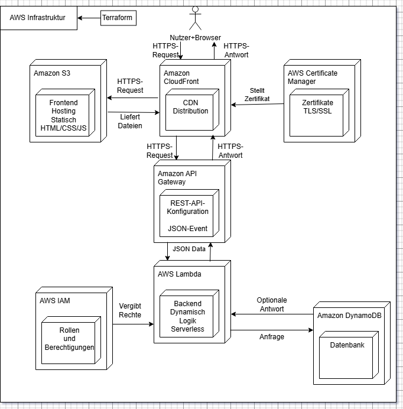

# Serverless Cloud-Website auf AWS – Infrastructure as Code mit Terraform

Vollständig per **Terraform** bereitgestellte Serverless-Webanwendung auf AWS:
statisches Frontend über CloudFront, dahinter eine REST-API mit Lambda und DynamoDB.
Die gesamte Infrastruktur ist als Code definiert und mit einem Befehl reproduzierbar.

## Architektur




- **Frontend:** S3-Bucket, der nicht öffentlich ist – Zugriff ausschließlich über
  CloudFront via Origin Access Control (OAC). Auslieferung erzwingt HTTPS.
- **Backend:** API Gateway (`GET /hello`) leitet per Lambda-Proxy-Integration an eine
  Node.js-Lambda weiter, die einen Eintrag in DynamoDB schreibt.
- **State/Daten:** DynamoDB-Tabelle im On-Demand-Modus (PAY_PER_REQUEST).
- **IAM:** Dedizierte Execution-Role für die Lambda nach dem Least-Privilege-Prinzip
  (nur Logs + `dynamodb:PutItem` auf die konkrete Tabelle).

## Verwendete AWS-Services & Tools

- **Terraform** (Provider: `hashicorp/aws`, Region `eu-central-1`)
- **Amazon S3** – Hosting der statischen Inhalte (privat)
- **Amazon CloudFront** – CDN + HTTPS, Zugriff via OAC
- **Amazon API Gateway** – REST-Endpunkt
- **AWS Lambda** – Backend-Logik (Node.js 20, AWS SDK v3)
- **Amazon DynamoDB** – Datenhaltung
- **AWS IAM** – Rollen und Policies

## Projektstruktur

```
.
├── terraform/
│   ├── providers.tf      # AWS-Provider, Region eu-central-1
│   ├── main.tf           # lokale Werte (Projektname)
│   ├── variables.tf      # Tags / Variablen
│   ├── s3.tf             # privater Frontend-Bucket + Public-Access-Block
│   ├── cloudfront.tf     # CloudFront-Distribution, OAC, Bucket-Policy
│   ├── api_gateway.tf    # REST-API, /hello, Lambda-Integration, Stage "prod"
│   ├── lambda.tf         # Lambda-Funktion, IAM-Role & Policies, Zip-Packaging
│   └── dynamodb.tf       # DynamoDB-Tabelle
├── lambda/
│   └── handler.js        # Node.js-Handler (schreibt Item in DynamoDB)
└── frontend/
    └── index.html        # statisches Frontend
```

## Deployment

Voraussetzungen: Terraform installiert, AWS-Zugangsdaten konfiguriert
(z. B. via `aws configure` oder Umgebungsvariablen).

```bash
cd terraform

terraform init        # Provider initialisieren
terraform plan        # geplante Änderungen prüfen
terraform apply       # Infrastruktur bereitstellen
```

Die Lambda wird beim `apply` automatisch aus dem `lambda/`-Verzeichnis gezippt und
hochgeladen. Nach erfolgreichem Apply gibt Terraform u. a. die `api_id` aus.

Aufräumen:

```bash
terraform destroy
```

## Hintergrund

Eigenes Uni-Lernprojekt zum Aufbau einer vollständig Infrastructure-as-Code-basierten
Serverless-Architektur auf AWS.
